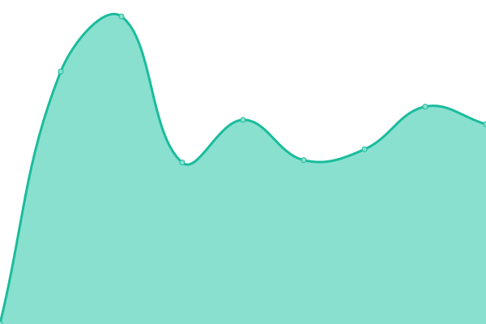

# [📈 Live Status](https://wang-task.github.io/upptime/): <!--live status--> **🟧 Partial outage**

<!--start: status pages-->
<!-- This summary is generated by Upptime (https://github.com/upptime/upptime) -->
<!-- Do not edit this manually, your changes will be overwritten -->
<!-- prettier-ignore -->
| URL | Status | History | Response Time | Uptime |
| --- | ------ | ------- | ------------- | ------ |
|  [网盘_alist](https://pan.wtz1.ml) | 🟥 Down | [alist.yml](https://github.com/wang-task/upptime/commits/HEAD/history/alist.yml) | 

 632ms
     
 | 

<a href="https://wang-task.github.io/upptime/history/alist">100.00%</a>
    

|  [探针_nezha](https://nz.wsee.cf) | 🟩 Up | [nezha.yml](https://github.com/wang-task/upptime/commits/HEAD/history/nezha.yml) | 

 1052ms
     
 | 

<a href="https://wang-task.github.io/upptime/history/nezha">100.00%</a>
    

|  [青龙面板_ql](https://ql.wtz1.ml) | 🟩 Up | [ql.yml](https://github.com/wang-task/upptime/commits/HEAD/history/ql.yml) | 

 698ms
     
 | 

<a href="https://wang-task.github.io/upptime/history/ql">100.00%</a>
    

|  [博客_blog](https://t.wtz1.ml) | 🟥 Down | [blog.yml](https://github.com/wang-task/upptime/commits/HEAD/history/blog.yml) | 

 0ms
     
 | 

<a href="https://wang-task.github.io/upptime/history/blog">0.00%</a>
    

|  [短链_d](https://d.wsee.cf) | 🟩 Up | [d.yml](https://github.com/wang-task/upptime/commits/HEAD/history/d.yml) | 

 342ms
     
 | 

<a href="https://wang-task.github.io/upptime/history/d">100.00%</a>
    

|  [Chatgpt-web-share](https://chat.wsee.cf) | 🟩 Up | [chatgpt-web-share.yml](https://github.com/wang-task/upptime/commits/HEAD/history/chatgpt-web-share.yml) | 

 366ms
     
 | 

<a href="https://wang-task.github.io/upptime/history/chatgpt-web-share">99.81%</a>
    

|  [Chatgpt-next](https://gpt.wtz1.ml) | 🟩 Up | [chatgpt-next.yml](https://github.com/wang-task/upptime/commits/HEAD/history/chatgpt-next.yml) | 

 310ms
     
 | 

<a href="https://wang-task.github.io/upptime/history/chatgpt-next">100.00%</a>
    

|  [Chatgpt-web_ui](https://gpt-old.wtz1.ml) | 🟩 Up | [chatgpt-web-ui.yml](https://github.com/wang-task/upptime/commits/HEAD/history/chatgpt-web-ui.yml) | 

 238ms
     
 | 

<a href="https://wang-task.github.io/upptime/history/chatgpt-web-ui">100.00%</a>
    

|  [Chatgpt-web_api](https://chat-wceshi.b4a.run) | 🟩 Up | [chatgpt-web-api.yml](https://github.com/wang-task/upptime/commits/HEAD/history/chatgpt-web-api.yml) | 

 2207ms
     
 | 

<a href="https://wang-task.github.io/upptime/history/chatgpt-web-api">100.00%</a>
    

|  [日志_logs](https://wang-task.github.io/logs) | 🟩 Up | [logs.yml](https://github.com/wang-task/upptime/commits/HEAD/history/logs.yml) | 

 150ms
     
 | 

<a href="https://wang-task.github.io/upptime/history/logs">100.00%</a>
    

|  [网易云音乐_wyyapi](https://163music.wang-admin.repl.co) | 🟩 Up | [wyyapi.yml](https://github.com/wang-task/upptime/commits/HEAD/history/wyyapi.yml) | 

 1084ms
     
 | 

<a href="https://wang-task.github.io/upptime/history/wyyapi">98.68%</a>
    

|  [离线下载_aria2-UI](https://pan.wang-admin.repl.co) | 🟩 Up | [aria2-ui.yml](https://github.com/wang-task/upptime/commits/HEAD/history/aria2-ui.yml) | 

 1545ms
     
 | 

<a href="https://wang-task.github.io/upptime/history/aria2-ui">98.43%</a>
    

|  [poe-replit-反代_poe](https://poe.wang5.repl.co) | 🟥 Down | [poe-replit-poe.yml](https://github.com/wang-task/upptime/commits/HEAD/history/poe-replit-poe.yml) | 

 3627ms
     
 | 

<a href="https://wang-task.github.io/upptime/history/poe-replit-poe">2.51%</a>
    

|  [在线人数统计_time-counter](https://time-counter.wtz1.ml) | 🟩 Up | [time-counter.yml](https://github.com/wang-task/upptime/commits/HEAD/history/time-counter.yml) | 

 477ms
     
 | 

<a href="https://wang-task.github.io/upptime/history/time-counter">98.92%</a>
    

|  [网站在线状态_uptime-kuma](https://uptime-kuma.wang-admin.repl.co) | 🟩 Up | [uptime-kuma.yml](https://github.com/wang-task/upptime/commits/HEAD/history/uptime-kuma.yml) | 

 378ms
     
 | 

<a href="https://wang-task.github.io/upptime/history/uptime-kuma">98.38%</a>
    

|  [网站在线状态_upptime](https://wang-task.github.io/upptime) | 🟩 Up | [upptime.yml](https://github.com/wang-task/upptime/commits/HEAD/history/upptime.yml) | 

 114ms
     
 | 

<a href="https://wang-task.github.io/upptime/history/upptime">100.00%</a>
    

<!--end: status pages-->

[**Visit our status website →**](https://wang-task.github.io/upptime/)
