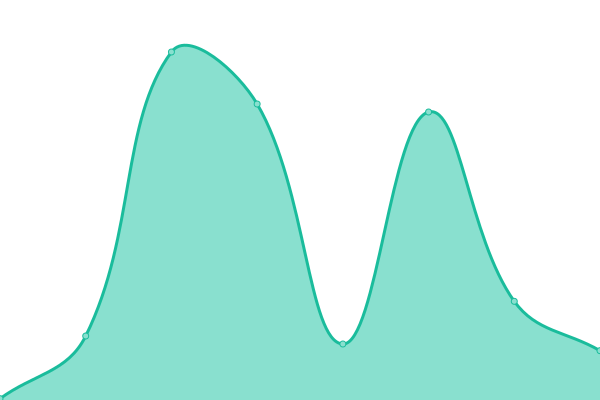

# [📈 Live Status](https://wang-task.github.io/upptime/): <!--live status--> **🟧 Partial outage**

<!--start: status pages-->
<!-- This summary is generated by Upptime (https://github.com/upptime/upptime) -->
<!-- Do not edit this manually, your changes will be overwritten -->
<!-- prettier-ignore -->
| URL | Status | History | Response Time | Uptime |
| --- | ------ | ------- | ------------- | ------ |
|  [网盘_alist](https://pan.wsee.eu.org) | 🟥 Down | [alist.yml](https://github.com/wang-task/upptime/commits/HEAD/history/alist.yml) | 

 640ms
     
 | 

<a href="https://wang-task.github.io/upptime/history/alist">0.00%</a>
    

|  [探针_nezha](https://nz.wsee.cf) | 🟩 Up | [nezha.yml](https://github.com/wang-task/upptime/commits/HEAD/history/nezha.yml) | 

 1189ms
     
 | 

<a href="https://wang-task.github.io/upptime/history/nezha">100.00%</a>
    

|  [博客_blog](https://t.wsee.eu.org) | 🟥 Down | [blog.yml](https://github.com/wang-task/upptime/commits/HEAD/history/blog.yml) | 

 0ms
     
 | 

<a href="https://wang-task.github.io/upptime/history/blog">0.00%</a>
    

|  [短链_d](https://wsee.cf) | 🟩 Up | [d.yml](https://github.com/wang-task/upptime/commits/HEAD/history/d.yml) | 

 506ms
     
 | 

<a href="https://wang-task.github.io/upptime/history/d">100.00%</a>
    

|  [Chatgpt-web-share](https://chat.wsee.cf) | 🟥 Down | [chatgpt-web-share.yml](https://github.com/wang-task/upptime/commits/HEAD/history/chatgpt-web-share.yml) | 

 0ms
     
 | 

<a href="https://wang-task.github.io/upptime/history/chatgpt-web-share">0.00%</a>
    

|  [Chatgpt-next](https://gpt.old.wsee.eu.org) | 🟩 Up | [chatgpt-next.yml](https://github.com/wang-task/upptime/commits/HEAD/history/chatgpt-next.yml) | 

 287ms
     
 | 

<a href="https://wang-task.github.io/upptime/history/chatgpt-next">100.00%</a>
    

|  [Chatgpt-web_ui](https://gpt-old.old.wsee.eu.org) | 🟩 Up | [chatgpt-web-ui.yml](https://github.com/wang-task/upptime/commits/HEAD/history/chatgpt-web-ui.yml) | 

 183ms
     
 | 

<a href="https://wang-task.github.io/upptime/history/chatgpt-web-ui">100.00%</a>
    

|  [日志_logs](https://wang-task.github.io/logs) | 🟩 Up | [logs.yml](https://github.com/wang-task/upptime/commits/HEAD/history/logs.yml) | 

 150ms
     
 | 

<a href="https://wang-task.github.io/upptime/history/logs">100.00%</a>
    

|  [网易云音乐_wyyapi](https://163music.wang-admin.repl.co) | 🟥 Down | [wyyapi.yml](https://github.com/wang-task/upptime/commits/HEAD/history/wyyapi.yml) | 

 518ms
     
 | 

<a href="https://wang-task.github.io/upptime/history/wyyapi">0.00%</a>
    

|  [在线人数统计_time-counter](https://time-counter.wsee.eu.org) | 🟥 Down | [time-counter.yml](https://github.com/wang-task/upptime/commits/HEAD/history/time-counter.yml) | 

 0ms
     
 | 

<a href="https://wang-task.github.io/upptime/history/time-counter">0.00%</a>
    

|  [网站在线状态_upptime](https://wang-task.github.io/upptime) | 🟩 Up | [upptime.yml](https://github.com/wang-task/upptime/commits/HEAD/history/upptime.yml) | 

 107ms
     
 | 

<a href="https://wang-task.github.io/upptime/history/upptime">100.00%</a>
    

<!--end: status pages-->

[**Visit our status website →**](https://wang-task.github.io/upptime/)
